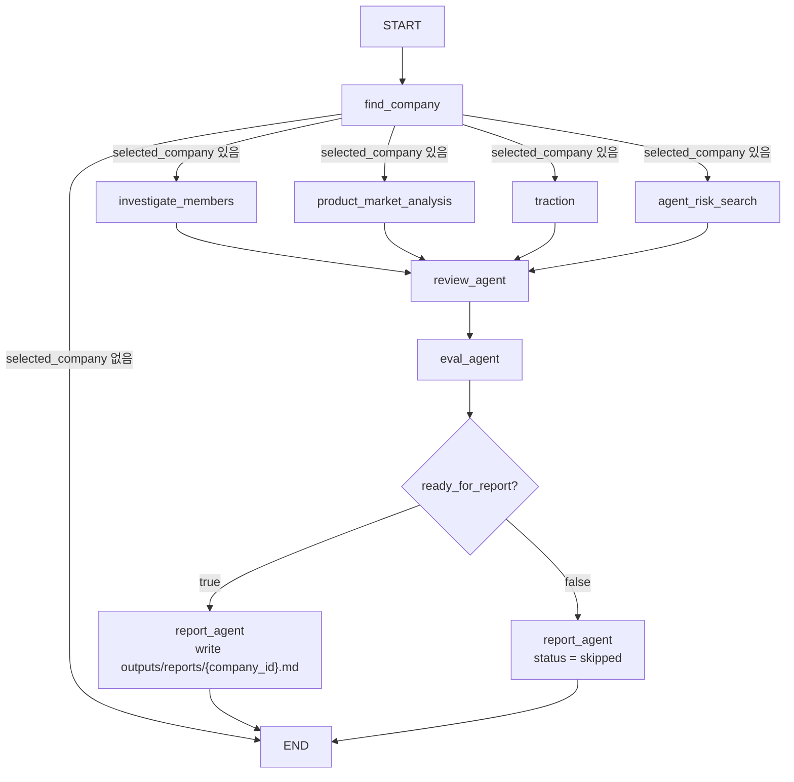

# AI Startup Investment Evaluation Agent

본 프로젝트는 AI 스타트업 중에서도 Robotics/Physical AI 방향으로 사업을 전개하는 회사를 대상으로, 공개 자료를 바탕으로 투자 가능성을 자동 평가하는 에이전트를 설계하고 구현한 실습 프로젝트입니다.

## Overview

- Objective: 로보틱스/Physical AI 스타트업의 기술력, 시장성, 팀 구성, 공개 리스크를 종합적으로 분석해 투자 적합성을 평가
- Method: LangGraph 기반 멀티에이전트 워크플로 + Agentic RAG + 웹 조사
- Tools: OpenAI API, Tavily Search, Firecrawl, PostgreSQL/SQLAlchemy, Chroma

## Features

- 자연어 질의를 받아 후보 회사를 검색하고 최종 조사 대상을 1개 선택
- 공개 웹 문서, 수집한 PDF/도메인 문서, 회사 DB를 함께 활용해 병렬 조사 수행
- 4개 병렬 조사 agent 결과를 shared review agent가 교차 검토
- `eval.md`의 C1~C6 루브릭에 따라 투자 판단(`invest`, `watch`, `pass`) 생성
- 최종 결과를 Markdown 보고서로 저장
  - 출력 경로: `outputs/reports/{company_id}.md`
- 일부 agent 실패 시 전체 그래프를 강제 종료하지 않고, `blocked` 또는 `skipped` 상태로 후속 단계에 반영

## Tech Stack

| Category | Details |
| --- | --- |
| Framework | Python, LangGraph, LangChain |
| LLM | `gpt-4o-mini` via OpenAI API (default, configurable by `OPENAI_MODEL`) |
| Retrieval | Local Chroma vector store (`vectordb/company`, `vectordb/domain`) |
| Embedding | `Qwen/Qwen3-Embedding-0.6B` |
| Data / Infra | PostgreSQL, SQLAlchemy, Tavily Search, Firecrawl, PDFPlumber |
| Output | Markdown report generation |

## Agents

### 1. `find_company`

- 사용자 자연어 질의를 구조화 검색 입력으로 변환
- PostgreSQL에서 회사 후보를 검색
- 후보가 여러 개인 경우 LLM이 최종 조사 대상을 1개 선택

### 2. `investigate_members`

- Tavily 기반 웹 검색으로 CEO/대표와 핵심 팀원을 조사
- 공식 홈페이지, 팀/리더십 페이지, 뉴스/인터뷰를 우선적으로 탐색
- 리더십 구성과 역할 커버리지를 structured output으로 정리

### 3. `product_market_analysis`

- 회사 문서 RAG, 도메인 문서 RAG, 웹 검색 도구를 조합해 제품/시장 조사 수행
- KPI logic, technical moat, data loop, product summary를 구조화
- writer 단계에서 참조 출처를 정규화하여 결과를 정리

### 4. `traction`

- vector 검색과 웹 검색을 혼합해 파트너십, 채용, 투자/성장 신호를 수집
- 외부 traction 증거를 구조화된 상태로 정리

### 5. `agent_risk_search`

- Tavily 뉴스 검색과 일반 웹 검색을 통해 공개 리스크를 탐지
- 인증, 특허, 규제, 부정 이슈 관련 신호를 structured output으로 정리

### 6. `review_agent`

- 4개 병렬 조사 결과를 함께 읽고 caution과 contradiction을 생성
- 교차 검토를 통해 상충되는 주장과 추가 확인 포인트를 요약

### 7. `eval_agent`

- `eval.md`의 C1~C6 평가 기준을 사용해 최종 투자 판단을 생성
- `final_decision`, `criteria_scores`, `key_strengths`, `key_risks`를 산출

### 8. `report_agent`

- 모든 병렬 조사 agent가 `completed`일 때 최종 Markdown 보고서 생성
- 하나라도 `completed`가 아니면 `report_state.status="skipped"`로 종료

참고:
- `agent_a`, `agent_b`, `agent_c` 패키지는 저장소에 남아 있지만 현재 메인 그래프에는 연결되어 있지 않습니다.

## Architecture

현재 메인 그래프는 회사 선정 이후 4개 조사 agent를 병렬 실행하고, 그 결과를 review/eval/report 단계로 연결하는 구조입니다.



- `selected_company`가 없으면 그래프는 즉시 종료됩니다.
- `ready_for_report=False`이면 평가 결과는 생성되더라도 파일 보고서는 작성되지 않습니다.

## Public Contract

- 입력: 자연어 질의 문자열
- 실행 진입점:

```bash
python main.py "<query>"
```

- 내부 산출:
  - `investigate_members_state`
  - `agent_product_market_analysis_state`
  - `traction_state`
  - `agent_risk_search_state`
  - `review_state`
  - `eval_state`
  - `report_state`
- 최종 산출: `outputs/reports/{company_id}.md` Markdown 보고서

## Evaluation Criteria

`eval.md`의 루브릭은 Robotics/AI 스타트업 투자 판단에 맞춰 아래 6개 기준으로 구성되어 있습니다.

| Criterion | Weight | Focus |
| --- | --- | --- |
| C1 | 20% | 창업자 및 핵심팀 신뢰도 |
| C2 | 15% | 시장 문제 및 도입 논리 명확성 |
| C3 | 20% | 제품 완성도 및 시스템 차별성 |
| C4 | 20% | 상용화 진전도 및 시장 검증 |
| C5 | 15% | AI 자율성 및 데이터 운영 우위 |
| C6 | 10% | 공개 리스크 및 안전·규제 대응 |

이 기준은 일반적인 스타트업 투자 프레임을 바탕으로 하되, 로보틱스/Physical AI 분야에서 중요한 제품화, 현장 배치, 시스템 통합, 안전/규제 대응 요소를 반영하도록 조정되었습니다.

## Directory Structure

```text
wonwon_agent/
├── agents/                    # 회사 탐색, 병렬 조사, review/eval/report agent
├── data/                      # 회사/도메인 문서 및 메타데이터
├── ingestion/                 # 문서 수집 및 corpus 구축 스크립트
├── outputs/                   # 생성 결과 저장 경로
├── prompts/                   # 프롬프트 템플릿
├── retrieval/                 # Chroma 및 embedding/retriever 계층
├── tests/                     # unittest 기반 테스트 코드
├── utils/                     # DB, taxonomy, prompt helper 등 공용 유틸
├── company_research_graph.py  # 메인 LangGraph 워크플로
├── eval.md                    # 평가 루브릭
├── main.py                    # CLI 실행 진입점
├── REPORT.md                  # 과제 제출용 프로젝트 설명 문서
└── README.md
```

## Validation

프로젝트에는 unittest 기반 테스트 파일이 준비되어 있으며, 아래와 같은 시나리오를 검증하도록 구성되어 있습니다.

- 회사 미선정 시 그래프 조기 종료
- 4개 병렬 조사 branch 완료 후 review/eval/report 성공
- 특정 조사 agent 실패 시 `eval_state.status="blocked"` 및 `report_state.status="skipped"`
- `find_company`의 structured filter, 후보 선택, fallback 동작
- `investigate_members`의 CEO 및 핵심팀 completion 기준
- `review_agent`의 caution / contradiction 구조화
- `eval_agent`의 C1~C6 점수 shape와 review 결과 반영
- `product_market_analysis`의 source filtering / reference normalization
- `agent_risk_search` 프롬프트의 JSON schema 렌더링 안정성

주요 테스트 파일:

- `tests/test_company_research_graph.py`
- `tests/test_agent_find_company.py`
- `tests/test_agent_investigate_members.py`
- `tests/test_agent_product_market_analysis.py`
- `tests/test_agent_review.py`
- `tests/test_agent_eval.py`
- `tests/test_agent_risk_search_prompts.py`
- `tests/test_traction_agent_real.py`

주의:
- 일부 테스트와 실제 실행은 OpenAI, Tavily, Firecrawl, PostgreSQL 등 외부 의존성과 환경변수 설정이 필요합니다.
- 따라서 본 문서에서는 “전체 테스트가 항상 통과한다”기보다, 해당 시나리오를 검증하도록 테스트가 준비되어 있다는 점에 초점을 둡니다.

## Limitations & Future Work

- `investigate_members`
  - CEO 확인 후 핵심팀을 재검색하는 2단계 전략이 아직 고도화되지 않음
  - 공식 홈페이지 본문 fetch/crawl 연결을 더 강화할 필요가 있음
- `product_market_analysis`
  - source balancing과 reference grounding 품질을 더 안정화할 필요가 있음
- `traction`
  - 실시간 검색 비용과 응답 속도 최적화가 필요함
  - 결과의 근거 출처를 보고서에 더 직접적으로 노출할 수 있음
- `agent_risk_search`
  - no-result 상황과 structured output 오류에 대한 내구성 보강이 필요함
- `review / eval / report`
  - contradiction 임계값, rubric calibration, Markdown 템플릿 품질을 추가 튜닝할 필요가 있음

## Notes

- 생성 보고서 `outputs/reports/*.md`는 `.gitignore`로 추적 제외됩니다.
- 비밀키와 환경변수는 로컬 `.env` 기반으로 관리하도록 설계되어 있습니다.
- 현재 문서는 과제 제출용 상세 설명 문서이며, 저장소 첫 화면용 소개 문서인 `README.md`와는 역할을 구분합니다.
